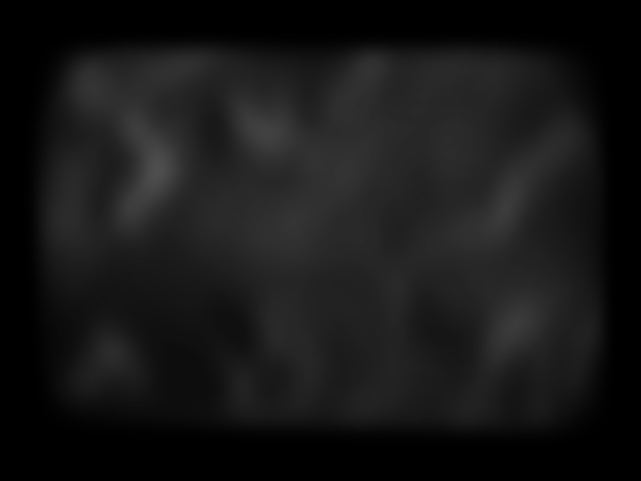

# Description (English)

# Heightmap Mesh Generator

This program generates a 3D mesh from a grayscale heightmap image. The output mesh consists of triangles and is saved in the `.obj` format, which can be viewed using 3D modeling software like Blender or MeshLab.

## How It Works

- The program processes grayscale `.png` images located in the `heightmaps` folder.
- Each pixel with a non-zero intensity corresponds to a vertex.
- The height (Y coordinate) of each vertex is scaled between 0 and 200 based on the pixel’s brightness.
- Triangles (faces) are created by connecting adjacent pixels where all necessary vertices exist.
- The vertices of each triangle are ordered counterclockwise.
- The generated 3D mesh is saved as an `.obj` file in the `result` folder, with one file per input image.

## License

This project is intended for educational use. The `stb_image.h` library used is open source and released into the public domain.

# Description (Magyar)

# Heightmap Mesh Generátor

Ez a program egy szürkeárnyalatos képet használ magasságtérképként, és háromszögekből álló 3D hálót (mesh-t) generál belőle. Az eredmény `.obj` formátumban kerül elmentésre, amely 3D modellező programokkal, például Blenderrel vagy MeshLab-bal megtekinthető.

## A program működése

- A program a heightmaps mappában található szürkeárnyalatos (.png) képeket dolgozza fel, melyeket magasságtérképként értelmez.
- Minden nem nulla intenzitású pixelhez egy csúcspont (vertex) tartozik, amelynek magassága a kép fényességi értéke alapján 0 és 200 közé van skálázva.
- Ezután a képen szomszédos pixelek alapján háromszögeket (face-eket) hoz létre, ha a szükséges csúcsok mind léteznek. A háromszögek csúcspontjainak sorrendje óramutató járásával ellentétes.
- A létrehozott 3D hálót a program .obj formátumban menti a result mappába, minden egyes bemeneti képfájlhoz külön fájl jön létre.

## Licenc

Ez a projekt oktatási célra készült. A `stb_image.h` fájl nyílt forráskódú (public domain).

