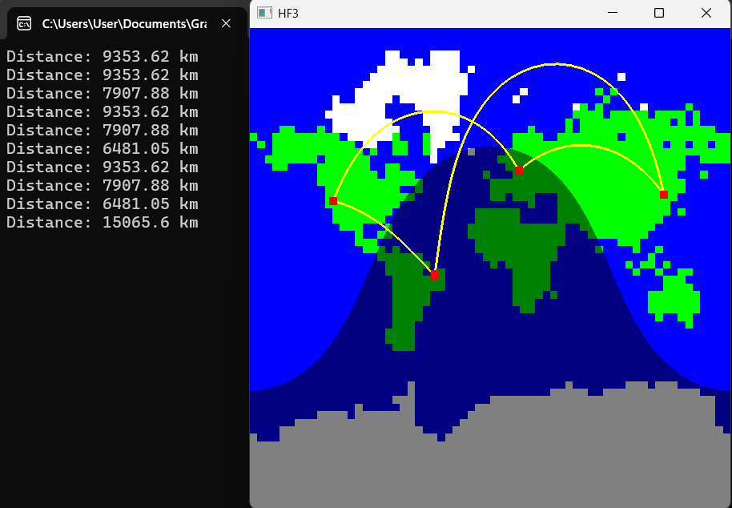

# Description (English)

The goal of the task is to draw the shortest paths between selected points on a Mercator map, assuming a spherical Earth with a circumference of 40,000 km, and to print the traveled distances to the console. The map covers the latitude range from -85 to +85 degrees and the longitude range from -180 to +180 degrees.

Route waypoints can be placed at the cursor position by clicking the left mouse button. The map is associated with a 64×64 resolution texture, displayed with GL_NEAREST filtering, which is defined by an indexed color, run-length encoded image.

In this encoding, for each byte, the upper 6 bits (denoted as H) and the lower 2 bits (I) define that H + 1 pixels of color index I are to be placed sequentially. The color indices mean:

I = 0: maximum intensity white

I = 1: maximum intensity blue

I = 2: maximum intensity green

I = 3: black

The image is defined by the following unsigned bytes:
[a long sequence of bytes follows in the original]

For rendering the map, each pixel must be checked to determine whether it is in daylight or nighttime. At nighttime, the colors must be set to 50% intensity. The program starts with the current time set to the summer solstice at 0:00 GMT. Pressing the n key advances the time by one hour without changing the date. The tilt of the Earth’s axis is approximately 23 degrees.

Between two waypoints, the great circle path on the sphere must be drawn as a polyline consisting of 100 points, with a line thickness of 3 and a color of maximum intensity yellow.

Waypoints are drawn as 10-pixel dots in maximum intensity red. Waypoints have higher visual priority than the paths. The time of day does not affect the colors of the paths or waypoints.

# Description (Magyar)

1. Feladatkiírás 
A feladat célja Mercator térképen a kijelölt pontok között a gömb alakú, 40 ezer km kerületű Földön a 
legrövidebb utak felrajzolása, és a megtett távolságok konzolra írása. A térkép a -85 és +85 fok 
szélességek és a -180 és +180 fok hosszúságok közötti tartományt mutatja. Az út állomásait az egér bal 
gombjának lenyomásával lehet elhelyezni a kurzor pozíciójában. A térképhez egy 64×64 felbontású, 
GL_NEAREST szűréssel megjelenített textúra tartozik, amelyet egy indexelt szín módú, futáshossz 
tömörítésű kép definiál. Ebben a kódolásban egy-egy bájt felső 6 bitjét 𝐻-val, az alsó két bitjét 𝐼-vel 
jelölve, 𝐻 + 1 darab 𝐼 indexű pixelt kell egymás mellé pakolni. Az 𝐼 index jelentése: 
�
� =0: maximális intenzitású fehér 
�
� =1: maximális intenzitású kék 
�
� =2: maximális intenzitású zöld 
�
� =3: fekete 
A kép a következő előjel nélküli bájtokból áll: 
252, 252, 252, 252, 252, 252, 252, 252, 252, 0, 9, 80, 1, 148, 13, 72, 13, 140, 25, 60, 21, 132, 41, 12, 1, 28, 
25, 128, 61, 0, 17, 4, 29, 124, 81, 8, 37, 116, 89, 0, 69, 16, 5, 48, 97, 0, 77, 0, 25, 8, 1, 8, 253, 253, 253, 253, 
101, 10, 237, 14, 237, 14, 241, 10, 141, 2, 93, 14, 121, 2, 5, 6, 93, 14, 49, 6, 57, 26, 89, 18, 41, 10, 57, 26, 
89, 18, 41, 14, 1, 2, 45, 26, 89, 26, 33, 18, 57, 14, 93, 26, 33, 18, 57, 10, 93, 18, 5, 2, 33, 18, 41, 2, 5, 2, 5, 6, 
89, 22, 29, 2, 1, 22, 37, 2, 1, 6, 1, 2, 97, 22, 29, 38, 45, 2, 97, 10, 1, 2, 37, 42, 17, 2, 13, 2, 5, 2, 89, 10, 49, 
46, 25, 10, 101, 2, 5, 6, 37, 50, 9, 30, 89, 10, 9, 2, 37, 50, 5, 38, 81, 26, 45, 22, 17, 54, 77, 30, 41, 22, 17, 58, 
1, 2, 61, 38, 65, 2, 9, 58, 69, 46, 37, 6, 1, 10, 9, 62, 65, 38, 5, 2, 33, 102, 57, 54, 33, 102, 57, 30, 1, 14, 33, 2, 
9, 86, 9, 2, 21, 6, 13, 26, 5, 6, 53, 94, 29, 26, 1, 22, 29, 0, 29, 98, 5, 14, 9, 46, 1, 2, 5, 6, 5, 2, 0, 13, 0, 13, 
118, 1, 2, 1, 42, 1, 4, 5, 6, 5, 2, 4, 33, 78, 1, 6, 1, 6, 1, 10, 5, 34, 1, 20, 2, 9, 2, 12, 25, 14, 5, 30, 1, 54, 13, 6, 
9, 2, 1, 32, 13, 8, 37, 2, 13, 2, 1, 70, 49, 28, 13, 16, 53, 2, 1, 46, 1, 2, 1, 2, 53, 28, 17, 16, 57, 14, 1, 18, 1, 14, 
1, 2, 57, 24, 13, 20, 57, 0, 2, 1, 2, 17, 0, 17, 2, 61, 0, 5, 16, 1, 28, 25, 0, 41, 2, 117, 56, 25, 0, 33, 2, 1, 2, 117, 
52, 201, 48, 77, 0, 121, 40, 1, 0, 205, 8, 1, 0, 1, 12, 213, 4, 13, 12, 253, 253, 253, 141 
A térkép megjelenítésénél minden pixelben el kell dönteni, hogy ott nappal vagy éjszaka van, és éjszaka 
esetén a színeket 50 %-sra kell állítani. A program indulásakor az aktuális idő a nyári napforduló, 0 óra 
GMT, az n billentyű lenyomásával az időt a nap változatlan hagyása mellett óránként lehet léptetni. A föld 
tengelyének ferdeségét vegyük közelítőleg 23 foknak. 
Két állomás között a gömbi kör Mercator vetületét 100 pontból álló törött vonallal kell felrajzolni. A 
vonalvastagság 3, a szín maximáis intenzitású sárga.  
Az állomások 10 pixeles pontok, színük maximális intenzitású piros. Az állomások prioritása nagyobb, mint 
az utaké. Az utak és állomások színét a napszak nem befolyásolja. 

