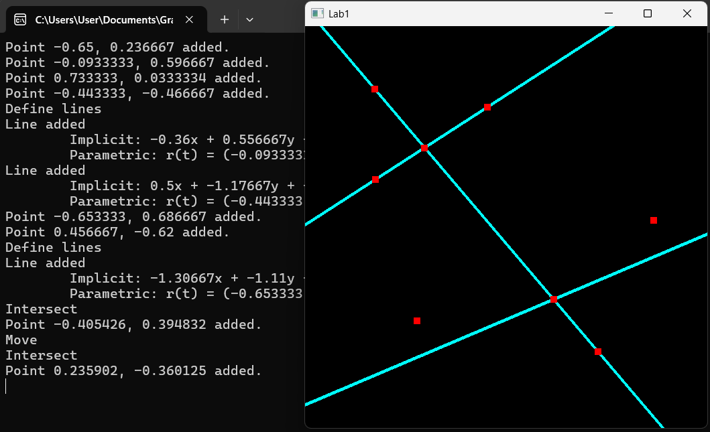

# Description (English)

1. Assignment Description
The goal of the first task is to revisit basic coordinate geometry and become familiar with OpenGL. The program to be developed allows users to place points via mouse clicks on a neatly chosen grey background, draw lines through those points, move the lines, and finally create new points at the intersections of selected lines. The point size is 10, and the line thickness is 3.

When a point and a line overlap, the point is visible (i.e., points have higher visual priority and will appear on top of lines when overlapping).

The world coordinate system matches the normalized device coordinate system, meaning that the rendered viewport corresponds to a square with corner points (-1, -1) and (1, 1). This viewport completely fills the 600x600 resolution application window.

In the CPU-side program, 2D geometry must be handled using an extrinsic representation—embedded into 3D space. This means that 2D points and vectors are stored as vec3 types, with z = 1 for points and z = 0 for vectors. Then, in the vertex shader, the 3D geometry is further embedded into 4D space using w = 1.

From a user perspective, the program has four states, which can be selected using the keys p, l, m, and i:

p: Point drawing – pressing the left mouse button places a maximum intensity red point at the cursor location (color coordinates: (1, 0, 0)).

l: Line drawing – requires two existing red points to be selected with the left mouse button. The resulting line appears in maximum intensity cyan (turquoise), with color coordinates (0, 1, 1).

m: Line movement – first select the line using the left mouse button; if successful, the line follows the cursor as long as the left button is held down and the mouse is moved.

i: Intersection – selects two lines and, if an intersection exists, places a new red point at the intersection.

The program prints the Cartesian coordinates of newly created points, as well as the implicit and parametric equations of the resulting lines, to the console.

# Description (Magyar)

 Feladatkiírás
Magyarul:
Az első feladat célja az alapvető koordinátageometriai ismeretek felelevenítése és az OpenGL-lel való ismerkedés. Az elkészítendő programmal ízlésesen megválasztott szürke háttéren egérkattintásokkal pontokat vehetünk fel, a pontokra egyeneseket illeszthetünk, az egyeneseket tologathatjuk, és végül a kiválasztott egyenesek metszéspontjaiból újabb pontok hozhatók létre. A pontméret 10-es, a vonalvastagság 3.

Ahol a pont és az egyenes fedésbe kerül, a pont látszik (azaz a pontnak nagyobb prioritása van, így fedés esetén takarja az egyenest).

A világ-koordinátarendszer megegyezik a normalizált eszköz-koordinátarendszerrel, azaz a keletkező fénykép (viewport) a (-1,-1) és (1,1) sarokpontú négyzetnek felel meg. A fénykép pedig teljes mértékben lefedi a 600x600 felbontású alkalmazói ablakot.

A CPU programban a 2D geometriát külső szemlélettel, azaz a 3D térbe ágyazva kell kezelni. Ez azt jelenti, hogy a 2D pontokhoz és vektorokhoz vec3 típust rendelünk, pontokra a 𝑧 = 1, vektorokra a 𝑧 = 0 választással. Majd a csúcspont árnyalóban a 3D geometriát 4D-be ágyazzuk be 𝑤 = 1 választással.

Felhasználói oldalról a programnak 4 állapota van, amelyeket rendre a p, l, m, i billentyűkkel lehet kiválasztani:

p: Pont rajzolás – az egér bal gombjának lenyomásakor a kurzor helyére egy maximális intenzitású piros pontot tesz (színkoordináták: (1, 0, 0)).

l: Egyenes rajzolás – két meglévő piros pontra kell rákattintani az egérrel. Az egyenes maximális intenzitású cián (türkizkék) színű lesz (színkoordináták: (0, 1, 1)).

m: Egyenes eltolás – először az egyenest kell kiválasztani az egérrel, ezután az egérrel mozgatható, amíg a gombot fel nem engedjük.

i: Metszéspont – két kiválasztott egyenes metszéspontjára (ha létezik) új piros pont kerül.

A program a keletkező pontok Descartes-koordinátáit, valamint az egyenesek implicit és paraméteres egyenleteit a konzolra kiírja.

