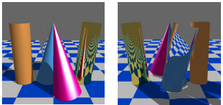

# Description (English)

# Ray Tracing with Tilted Cones and Cylinders

## Overview

This project is the implementation of an assignment at the Budapest University of Technology and Economics (BME). The goal is to implement a ray tracing engine that supports tilted cones and cylinders with realistic lighting and material properties. The rendered scene includes various geometries and materials, with support for reflection, refraction, and Phong-Blinn shading.

## Virtual Scene

The scene contains the following objects:

- 🟦⬜ **Checkerboard Ground Plane**  
  - Size: 20×20 meters, parallel to the xz-plane, y = –1  
  - Tiles: 1×1 meters, alternating blue and white  
  - Diffuse reflectivity:  
    - Blue: (0, 0.1, 0.3)  
    - White: (0.3, 0.3, 0.3)  
  - The tile at (0.5, 0.5, -1) is white.

- 🟡 **Gold Cylinder (Reflective)**  
  - Base point: (1, -1, 0)  
  - Axis direction: (0.1, 1, 0)  
  - Radius: 0.3  
  - Height: 2  
  - Optical properties:  
    - Refractive index: (0.17, 0.35, 1.5)  
    - Extinction coefficient: (3.1, 2.7, 1.9)

- 💧 **Water Cylinder (Transparent/Refractive)**  
  - Base point: (0, -1, -0.8)  
  - Axis direction: (-0.2, 1, -0.1)  
  - Radius: 0.3  
  - Height: 2  
  - Refractive index: 1.3 (constant)

- 🟠 **Yellow Plastic Cylinder (Diffuse + Specular)**  
  - Base point: (-1, -1, 0)  
  - Axis direction: (0, 1, 0.1)  
  - Radius: 0.3  
  - Height: 2  
  - Material: Phong-Blinn  
    - Diffuse: (0.3, 0.2, 0.1)  
    - Specular: (2, 2, 2)  
    - Shininess: 50

- 🔵 **Cyan Cone (Diffuse + Specular)**  
  - Apex: (0, 1, 0)  
  - Axis direction: (-0.1, -1, -0.05)  
  - Opening angle: 0.2 radians  
  - Height: 2  
  - Material: Phong-Blinn  
    - Diffuse: (0.1, 0.2, 0.3)  
    - Specular: (2, 2, 2)  
    - Shininess: 100

- 🟣 **Magenta Cone (Diffuse + Specular)**  
  - Apex: (0, 1, 0.8)  
  - Axis direction: (0.2, -1, 0)  
  - Opening angle: 0.2 radians  
  - Height: 2  
  - Material: Phong-Blinn  
    - Diffuse: (0.3, 0, 0.2)  
    - Specular: (2, 2, 2)  
    - Shininess: 20

## Camera

- **Initial position**: (0, 1, 4)  
- **Up vector**: (0, 1, 0)  
- **Looks at**: origin (0, 0, 0)  
- **Field of view**: 45°  
- **Aspect ratio**: 1.0  
- **Movement**: Pressing the `a` key rotates the camera 1/8th of a full circle  
- **Camera orbit**: in a horizontal plane (parallel to xz), centered on the y-axis intersection

## Lighting

- 🌞 **Directional light**:  
  - Direction: (1, 1, 1)  
  - Intensity: 2.0  

- 💡 **Ambient light**:  
  - Color: (1, 1, 1)  
  - Intensity: 0.4  

- **Ambient reflection**: For all materials, ambient reflectivity = 3× diffuse reflectivity

## Features

- Ray-object intersection for arbitrarily oriented cones and cylinders
- Reflections and refractions for metals and transparent materials
- Shadow computation with directional light
- Camera orbit with keyboard interaction
- Phong-Blinn shading model

## Requirements

- C++17 or newer compiler
- OpenGL and GLUT/GLFW libraries
- Linux or Windows development environment

## License

This project was created as part of the **BME IIT Graphics Lab** coursework. For educational use only.

# Description (Magyar)

# Sugárkövetés kúppal és hengerrel

## Áttekintés

Ez a projekt a Budapesti Műszaki és Gazdaságtudományi Egyetem feladatának megvalósítása. A program célja a sugárkövetés (ray tracing) algoritmus implementálása összetett, döntött tengelyű hengerekre és kúpokra. A világ tartalmaz többféle anyagtulajdonságú objektumot, valamint különböző típusú fényeket. A kamera körpályán mozgatható, a renderelés pedig valósághű árnyalással történik.

## Virtuális világ

A jelenet a következő objektumokat tartalmazza:

- 🟦⬜ **Sakktáblás talaj**:  
  - Méret: 20×20 m, az xz síkkal párhuzamos, y = –1
  - Csempe méret: 1×1 m
  - Színek: kék (diffúz: (0, 0.1, 0.3)) és fehér (diffúz: (0.3, 0.3, 0.3))
  - A (0.5, 0.5, -1) koordinátán fehér csempe található.

- 🟡 **Arany henger (tükör)**  
  - Alappont: (1, -1, 0)  
  - Tengely: (0.1, 1, 0)  
  - Sugár: 0.3  
  - Magasság: 2  
  - Anyag: fémes, reflexiós tulajdonságok  
    - Törésmutató: (0.17, 0.35, 1.5)  
    - Kioltási tényező: (3.1, 2.7, 1.9)

- 💧 **Víz henger (átlátszó)**  
  - Alappont: (0, -1, -0.8)  
  - Tengely: (-0.2, 1, -0.1)  
  - Sugár: 0.3  
  - Magasság: 2  
  - Anyag: átlátszó, fénytörő  
    - Törésmutató: 1.3 (állandó)

- 🟠 **Sárga műanyag henger (diffúz + spekuláris)**  
  - Alappont: (-1, -1, 0)  
  - Tengely: (0, 1, 0.1)  
  - Sugár: 0.3  
  - Magasság: 2  
  - Anyag: Phong-Blinn  
    - Diffúz: (0.3, 0.2, 0.1)  
    - Spekuláris: (2, 2, 2)  
    - Shininess: 50

- 🔵 **Cián kúp (diffúz + spekuláris)**  
  - Csúcs: (0, 1, 0)  
  - Tengely: (-0.1, -1, -0.05)  
  - Nyílásszög: 0.2 rad  
  - Magasság: 2  
  - Anyag: Phong-Blinn  
    - Diffúz: (0.1, 0.2, 0.3)  
    - Spekuláris: (2, 2, 2)  
    - Shininess: 100

- 🟣 **Magenta kúp (diffúz + spekuláris)**  
  - Csúcs: (0, 1, 0.8)  
  - Tengely: (0.2, -1, 0)  
  - Nyílásszög: 0.2 rad  
  - Magasság: 2  
  - Anyag: Phong-Blinn  
    - Diffúz: (0.3, 0, 0.2)  
    - Spekuláris: (2, 2, 2)  
    - Shininess: 20

## Kamera

- **Pozíció (kezdetben)**: (0, 1, 4)
- **Függőleges irány**: (0, 1, 0)
- **Nézeti irány**: az origó felé
- **Látószög**: 45°
- **Képarány**: 1 (négyzetes képarány)
- **Mozgás**: Az `a` billentyű lenyomására a kamera körpályán, 45°-os lépésekkel elmozdul
- **Kör síkja**: xz síkkal párhuzamos
- **Kör középpontja**: az y tengely és a kör síkjának metszéspontja

## Világítás

- 🌞 **Irányfény**:  
  - Irány: (1, 1, 1)  
  - Intenzitás: 2.0  
- 💡 **Ambiens fény**:  
  - Szín: (1, 1, 1)  
  - Intenzitás: 0.4  
- **Ambiens visszaverődés**:  
  - Minden anyagra a diffúz visszaverődés háromszorosa

## Megvalósítási jellemzők

- Sugár–objektum metszéspont számítás kúppal és hengerrel (tetszőleges tengelyirány)
- Reflexió és törés kezelése (fémes és átlátszó anyagok)
- Árnyék számítás direkcionális fénnyel
- Kamera körpályás mozgatása
- Phong-Blinn világítási modell

## Követelmények

- C++17 vagy újabb fordító
- OpenGL és GLUT/GLFW könyvtárak
- Linux vagy Windows fejlesztői környezet

## Licenc

Ez a projekt a **BME IIT Grafika labor** feladatának részeként készült. Oktatási célokra használható.

