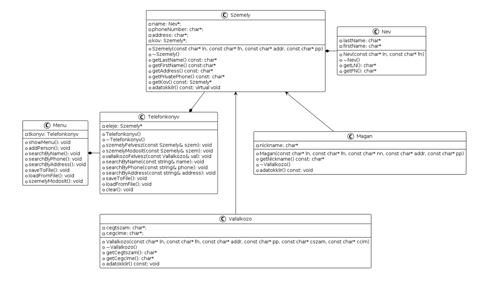

# Description (English)
Phonebook – Program Plan

The goal is to develop a program in an object-oriented way using the C++ programming language, which enables easy handling of a phonebook database. The program features a text-based user interface, is menu-driven, and supports the following menu options:

• Add a new person
• Enter personal details including: surname, first name, nickname, address, work phone number, and private phone number
• Search by name, phone number, or address
• Save data to a .txt file
• Load data from a .txt file
• Modify or delete data
• Exit

Program Functionality:

• Upon starting, the program displays the menu in a command-line window
• After selecting a menu option, the corresponding operation is executed
• The user can continue selecting options until they choose “Exit”
• The “Exit” option also allows returning from submenus

Data Management:

• Data is archived in a adatok.txt file
• adatok.txt is a plain text file containing the data in simple text format
• The program can only read from and write to .txt files

Operations:

• Add person:

Input: personal details

Output: person successfully/unsuccessfully added

• Search the phonebook:

Input: person's name / phone number / address

Output: listed details of the person

• Save data to adatok.txt:

Output: successful/unsuccessful save

• Load data from adatok.txt:

Output: successful/unsuccessful load

• Modify person’s data:

Input: data to be modified

Output: successful/unsuccessful modification

• Exit:

Output: Exiting…

# Description (Magyar)

Telefonkönyv – Programterv

Cél egy olyan program készítése objektum orientált módon, C++ programnyelven, amellyel könnyen lehet telefonkönyv adatbázissal dolgozni. A program szöveges felhasználói felület kialakítású, menüvezérelt rendszerű, és a következő menüpontokat tudja végrehajtani:

• Új személy felvétele
• Személyhez tartozó adatok: név (vezetéknév, keresztnév), becenév, cím, munkahelyi szám, privát szám megadása
• Keresés névre, telefonszámra, címre
• Adatok mentése .txt fájlba
• Adatok betöltése .txt fájlból
• Adatok módosítása vagy törlése
• Kilépés

Program működése:

• A program indításakor egy parancssori ablakban jelenik meg a menü
• A megfelelő menüpont kiválasztása után végrehajtásra kerül a művelet
• A menüből mindaddig lehet választani, amíg a felhasználó a „Kilépés” lehetőséget nem választja
• A „Kilépés” lehetőséggel az almenükből is vissza lehet térni

A program adatkezelése:

• Az adatok archiválása az adatok.txt fájlban történik
• Az adatok.txt egy egyszerű szöveges fájl
• A program kizárólag .txt kiterjesztésű fájlokat tud írni és olvasni

Műveletek:

• Személy felvétele

Bemenet: személy adatai

Kimenet: sikeres/sikertelen felvétel

• Keresés a telefonkönyvben

Bemenet: személy neve / telefonszáma / címe

Kimenet: személy adatai kilistázva

• Adatok mentése az adatok.txt fájlba

Kimenet: sikeres/sikertelen mentés

• Adatok betöltése az adatok.txt fájlból

Kimenet: sikeres/sikertelen betöltés

• Személy adatainak módosítása

Bemenet: módosítandó adat

Kimenet: sikeres/sikertelen módosítás

• Kilépés

Kimenet: Exiting…

# Class diagram
