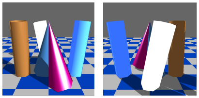

# Description (English)

# Triangle-Based Shading and Ray-Traced Shadow Rendering

## Overview

This project is a 3D graphics application that renders a scene composed of tessellated cones, cylinders, and a square plane. Lighting is based on the Phong illumination model, and shadows from a directional light source are computed using ray tracing in the fragment shader. The goal is to achieve realistic rendering using tessellated geometry and per-fragment shadow calculation.

## Features

- Tessellated geometry: cones, cylinders, and a square broken into triangles
- Phong shading model via vertex and fragment shaders
- Shadow calculation with ray tracing per fragment
- Directional and ambient light sources
- VAO/VBO-based GPU geometry transfer
- Accurate normal vector computation using parametric surface derivatives and inverse transformation matrices

## Geometry & Tessellation

- **Cylinders and Cones**:
  - Each approximated with 12 triangles (6 per base)
  - Cone tip can be omitted, resulting in a truncated cone
- **Square**:
  - Constructed from 2 triangles
  - Uses a checkerboard texture

## Material Models

- Replacement of optically smooth materials (gold, water) with rough surface equivalents:
  - Refractive index `n` → diffuse reflectivity
  - Extinction coefficient `κ` → specular reflectivity

## Shadow Implementation

- Directional light shadows computed via ray-triangle intersection in the **fragment shader**
- In shadowed areas, only ambient lighting is applied
- Geometry data passed via **uniforms** for shadow testing

## Class Architecture

- **Object3D**: Manages VAO/VBO and tessellation logic
- **Derived Classes**: `Cone`, `Cylinder`, `Quad`
- **Scene**:
  - Stores heterogeneous objects
  - Contains lights and camera
  - `build()` – constructs the scene
  - `render()` – sends uniform variables and draws objects

## Prerequisites

- Geometric modeling
- 3D image synthesis
- Ray tracing (especially ray-triangle intersection)

## License

This software is part of the Graphics Lab course at BME.

# Description (Magyar)

# Tesszellált háromszögekkel megvalósított árnyékolás és árnyékszámítás

## Áttekintés

Ez a projekt egy háromdimenziós grafikai alkalmazás, amely tesszellált kúpból, hengerből és négyzetből felépített jelenetet jelenít meg. A megvilágítás Phong-modellen alapul, az irányfény árnyékait pedig a fragment shader-ben megvalósított sugárkövetéses algoritmus számítja ki. A program célja egy valósághű képszintézis megvalósítása tesszellációval és árnyékszámítással.

## Funkciók

- Háromszögekre tesszellált geometriai objektumok (kúp, henger, négyzet)
- Phong típusú árnyalás vertex és fragment shaderrel
- Árnyékszámítás sugárkövetéssel a fragment shaderben
- Irány- és ambiens fény támogatása
- GPU-ra feltöltött VAO/VBO adatszerkezetek
- Normálvektorok számítása parciális deriváltakkal és transzformációs mátrixokkal

## Geometriák és tesszelláció

- **Henger és kúp**:
  - 12 háromszögből állnak (mindkét végükön 6-6 háromszög)
  - A kúp csúcsa elhagyható, csonka kúp formájában jelenik meg
- **Négyzet**:
  - Két háromszögből áll, sakktábla textúrával

## Anyagmodellek

- Az arany és víz anyagok rücskössé alakítása:
  - Törésmutató (`n`) → diffúz visszaverődési tényező
  - Kioltási tényező (`κ`) → spekuláris visszaverődési tényező

## Árnyékkezelés

- Az irányfény árnyéka a fragment shaderben valósul meg sugárkövetéssel
- Az árnyékban csak az ambiens fény számít
- Háromszög-takarás ellenőrzés: ray-triangle metszéspont algoritmus uniform változókkal

## Osztálystruktúra

- **Object3D**: VAO/VBO menedzsment, tesszelláció
- **Származtatott osztályok**: `Cone`, `Cylinder`, `Quad`
- **Scene**:
  - Heterogén objektumtárolás
  - Fényforrások és kamera tárolása
  - `build()` – a színtér összeállítása
  - `render()` – objektumok kirajzolása és uniform változók beállítása

## Előfeltételek

- Geometriai modellezés
- 3D képszintézis
- Sugárkövetés (ray-triangle intersection algoritmus)

## Licenc

Ez a program a BME Villamosmérnöki és Informatikai Kar Grafika laborjának keretében készült.

