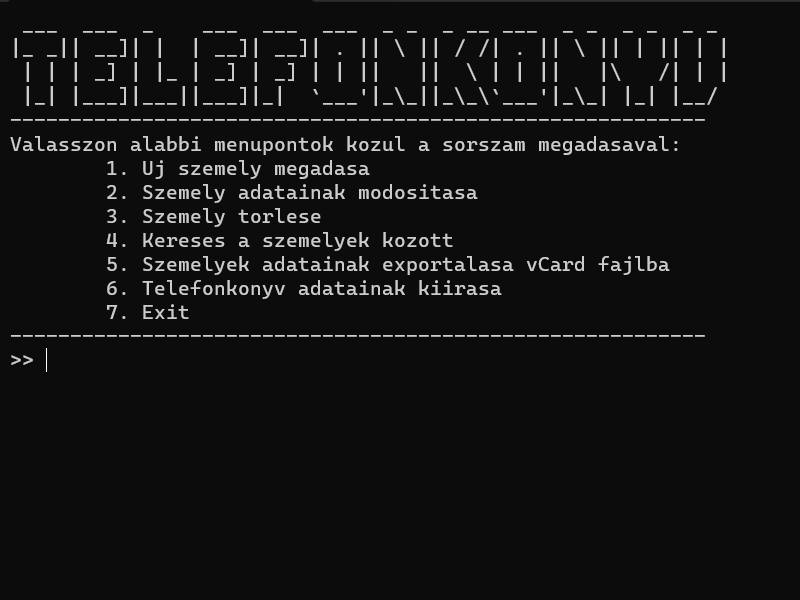

# Description (English)

Phonebook:

The phonebook program allows you to store data of individuals with a phone (such as name, address, phone number, and additional information). You can search, modify, or delete these records. Upon startup, if the phonebook was previously saved, it will automatically load from the adatok.vcf data file. If no data was saved before, this file will be empty.

The program runs in a command-line window and is menu-driven, with the following options:

• Add a new person
• Enter address and additional information for a name and phone number
• Search by name (with * wildcard), phone number, or address
• Save data to a vCard file
• Load data from a vCard file
• Modify or delete data
• Display the phonebook entries
• Exit

# Description (Magyar)

Telefonkönyv:

A telefonkönyv programmal telefonnal rendelkezők adatait (nevét, címét, telefonszámát, 
egyéb információkat) tárolhatjuk, az adatok között kereshetünk, módosíthatjuk, vagy törölhetjük 
azokat. Indítás után, amennyiben korábban elmentettük a telefonkönyvet, ez automatikusan 
betöltődik az adatok.vcf adatállományból, ha még nem volt adatmentés akkor ez a file üres. 

A program indításakor egy parancssori ablakban jelenik meg. A program menü vezérelt, 
amelyben a következő menüpontok vannak:

• Új személy felvétele. 
• Névhez és telefonszámhoz tartozó adatok (cím, egyéb adat) megadása. 
• Keresés névre (* helyettesítő karakterrel), telefonszámra, címre. 
• Adatok mentése vCard file-ba. 
• Adatok betöltése vCard file-ból. 
• Adatok módosítása vagy törlése. 
• Telefonkönyv adatainak kiírása.
• Kilépés.

