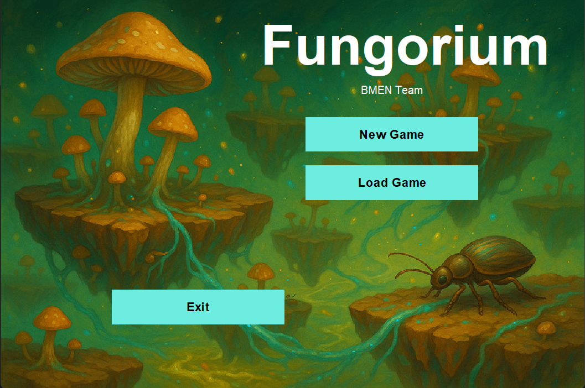
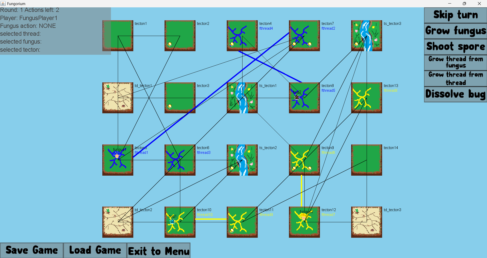
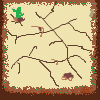
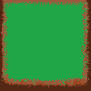
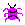

# Description (English)

# Fungorium – Turn-Based Strategy Game

## Overview

**Fungorium** is a multiplayer, turn-based strategy game developed in Java. The game takes place on the fictional planet Fungorium, where players take on asymmetric roles: **Mycologists** (fungus growers) and **Entomologists** (insect controllers). Players influence the environment, spread fungi or insects, and interact with a dynamic tectonic landscape.

## Gameplay

- **Players**: 4 to 6 (2–3 Mycologists and 2–3 Entomologists)
- **Platform**: Desktop, offline
- **Persistence**: Save/load functionality for game state
- **Mode**: Turn-based

### Roles

- **Mycologists**
  - Direct fungal thread growth
  - Spread spores from fungus bodies
  - Grow new fungus bodies

- **Entomologists**
  - Control insects to traverse fungal threads
  - Eat spores for nutrients
  - Cut fungal threads to block opponents

### Key Concepts

- **Tectons**: Hexagonal map tiles that float on a viscous surface. They may split after a number of turns, affecting connectivity.
- **Fungi**:
  - Consist of threads and bodies
  - Bodies produce spores every few turns
  - Threads allow expansion and can grow new fungus bodies
- **Spores**:
  - Vary in effects: speed boost, paralysis, cutting inhibition, or neutral
  - Each has a random nutrient value (1–5)
- **Insects**:
  - Follow fungal threads between tectons
  - Can consume spores and gain abilities or penalties
  - Cannot move across tectons without a fungal thread

### Win Conditions

- **Mycologists**: Win by having the most developed (alive or dead) fungus bodies after a predefined number of turns.
- **Entomologists**: Win by collecting the most nutrients from spores.

## Features

- Dynamic tecton splitting
- Local game state saving/loading
- Complex spore interaction effects
- Different tecton properties (e.g. restrict fungal growth, decay threads)
- Unique actions per player type each turn

## Technical Requirements

- **Language**: Java
- **JDK Version**: 20.0.2 or newer
- **Input Devices**: Keyboard and Mouse
- **No external libraries**: Fully self-contained codebase

## Build & Run

### Compile
```bash
javac -d bin src/**/*.java
```

### Run
```bash
java -cp bin Main
```

## Development Guidelines

- Use Git with feature branches and a stable release-ready `main` branch
- Development IDE: Eclipse or IntelliJ IDEA
- Project collaboration and documentation via Discord, Google Docs, and Google Drive

## Save/Load Instructions

The game supports saving and loading state via local file system, allowing players to continue a session at any time.

## License

This project was developed as part of a software engineering course at **BME Villamosmérnöki és Informatikai Kar**. It is for educational purposes only.


# Description (Magyar)

# Fungorium – Körökre osztott stratégiai játék

## Áttekintés

A **Fungorium** egy Java nyelven fejlesztett, többjátékos körökre osztott stratégiai játék. A képzeletbeli **Fungorium** bolygón játszódik, ahol a játékosok kétféle szerepet tölthetnek be: **gombászok** (a gombák terjesztéséért felelnek) és **rovarászok** (rovarokat irányítanak). A játék célja a saját fajod minél hatékonyabb terjesztése és a környezet kihasználása.

## Játékmenet

- **Játékosok száma**: 4–6 (2–3 gombász és 2–3 rovarász)
- **Platform**: Asztali gép, offline
- **Állapotmentés**: A játék elmenthető és visszatölthető
- **Műfaj**: Körökre osztott stratégia

### Szerepek

- **Gombászok**
  - Gombafonalak irányítása
  - Spórák szórása a gombatestekből
  - Új gombatestek növesztése

- **Rovarászok**
  - Rovarok mozgatása a fonalakon
  - Spórák elfogyasztása tápanyagért
  - Gombafonalak átvágása

### Alapfogalmak

- **Tektonok**: Hatlapú térképelemek, amelyek idővel kettétörhetnek, és különböző tulajdonságokkal bírhatnak.
- **Gombák**:
  - Gombafonalakból és gombatestekből állnak
  - A gombatestek időszakonként spórákat szórnak
  - A gombafonalak segítségével új tektonokra is kiterjedhetnek
- **Spórák**:
  - Véletlenszerű hatással bírhatnak (pl. gyorsítás, bénítás, vágásgátlás)
  - Minden spórának van tápanyagtartalma (1–5)
- **Rovarok**:
  - Csak fonalon keresztül tudnak mozogni
  - Spórákat esznek, amik hatással lehetnek rájuk
  - Fonalakat is átvághatnak, ha nincs rájuk hatással spóra

### Győzelmi feltételek

- **Gombászok**: Az nyer, akinek a legtöbb gombatestje fejlődött ki a játék végére (akár élő, akár elpusztult).
- **Rovarászok**: Az nyer, aki a legtöbb tápanyagot gyűjtötte be spórákból.

## Főbb funkciók

- Dinamikus tektonkettétörés
- Játékállapot mentése és betöltése
- Spórák változatos hatásai
- Tektonspecifikus szabályok (pl. gombafonal eltűnés)
- Játékosonként 2 művelet / kör

## Technikai követelmények

- **Nyelv**: Java
- **JDK verzió**: 20.0.2 vagy újabb
- **Beviteli eszközök**: Billentyűzet és egér
- **Külső könyvtárak**: Nem használható

## Fordítás és futtatás

### Fordítás
```bash
javac -d bin src/**/*.java
```

### Futás
```bash
java -cp bin Main
```

## Fejlesztési irányelvek

- Verziókezelés: Git, feature branching + stabil `main` ág
- Fejlesztőkörnyezet: Eclipse vagy IntelliJ IDEA
- Kommunikáció: Discord
- Dokumentumkezelés: Google Docs és Drive

## Mentés és betöltés

A játék támogatja az aktuális állapot mentését és későbbi visszatöltését.

## Licenc

Ez a projekt a **BME Villamosmérnöki és Informatikai Kar** egy tárgyának részeként készült, kizárólag oktatási célokra.





  

 