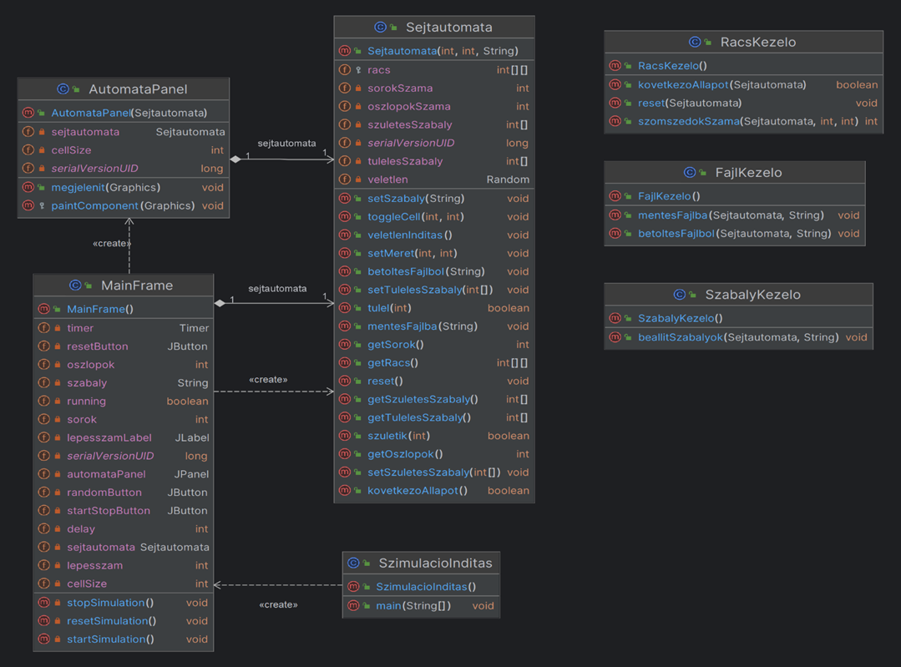

# Description (English)

Game of Life - Developer Documentation
1. Task Overview
The project aims to implement a cellular automaton simulation, focusing on the rules of Conway’s Game of Life and other similar automata. The simulation takes place on a 2D grid where each cell is in a specific state (e.g., alive or dead) and changes state depending on its neighbors. Users can set various initial states, save and load grid states, and define custom rules for the simulation. The program supports dynamic input of different cellular automaton rules, such as Conway’s Game of Life (B3/S23), and other variants like Day and Night, HighLife, or Maze.

2. Use Cases
Start and stop the simulation – The user can start or stop the simulation via the GUI at any time.

Set simulation speed – The user can define the speed of simulation iterations.

Save and load states – The current grid state can be saved and later reloaded in JSON file format.

Set grid size – The user can dynamically configure the grid dimensions before starting the simulation.

Define initial state – Users can manually configure the initial placement of cells.

Set rules – Users can define custom rules using the B../S.. format or select from predefined rule sets.

3. Implementation Concept
Technologies Used: The application is developed in Java using the Swing library for the graphical user interface (GUI).

Data Management: States are saved and loaded using JSON files, with the help of the Gson library.

Grid Management: The cellular automaton is represented as a 2D array, storing the current state of each cell. GUI elements control the grid's size and visual representation, dynamically updating the display.

Dynamic Rule Definition: Rules follow the B../S.. format, which the user can input manually or select from preset rules via the GUI, and the simulation adapts accordingly.

4. User Manual
Starting, restarting, and stopping the simulation:
After launching the application, the user can start the simulation by clicking the Start button at the bottom of the screen. While running, this button changes to Stop, allowing the user to stop the simulation at any time. Clicking the Restart button resets all cells on the grid to the default state. The application can be closed as usual by clicking the X in the top right corner.

Setting speed and grid size:
The user can access the Simulation menu at the top of the window to adjust the Speed and Grid Size. These options allow the user to change the default values according to the specified criteria.

Saving and loading state:
From the File menu at the top, the user can choose Save or Load. When saving, the current simulation state is saved in a JSON file format, which can later be reloaded using the Load option.

Setting the initial state:
Users can define custom initial states by clicking on the cells in the grid. Alternatively, clicking the Random Fill button generates a random initial configuration, which can still be modified before starting the simulation.

Setting the rule system:
The user can set or change the rules by clicking on the currently selected rule in the top menu. Within this menu, choosing the Custom Rule… option allows the user to input any rule using the B../S.. format.

# Description (Magyar)

Életjáték Programozói Dokumentáció

1. Feladat rövid ismertetése
A projekt egy sejtautomata szimuláció megvalósítását célozza, különös tekintettel az Életjáték szabályaira és más hasonló automatákra. A szimuláció egy 2D rácsban történik, ahol minden cella adott állapotban (pl. élő vagy halott) van, és a környezetétől függően változik. A felhasználók képesek lesznek különböző kezdőállapotokat beállítani, menteni és visszatölteni az állapotokat, valamint szabályokat megadni a szimuláció során. A program támogatja a különféle sejtautomata szabályok dinamikus megadását, pl. a Conway-féle Életjátékot (B3/S23), és más variánsokat, mint a Day and Night, HighLife, vagy Maze.
2. Use-case-ek
1.	Szimuláció indítása és leállítása: A felhasználó képes a szimulációt elindítani és bármikor leállítani a GUI-n keresztül.
2.	Sebesség beállítása: A felhasználó meghatározhatja a szimuláció iterációinak sebességét.
3.	Állapot mentése és betöltése: A rács aktuális állapota elmenthető és visszatölthető JSON fájl formátumban.
4.	Rács méretének megadása: A felhasználó dinamikusan beállíthatja a rács méretét a szimuláció megkezdése előtt.
5.	Kezdőállapot beállítása: A felhasználó egyéni kezdőállapotokat adhat meg a cellák kezdeti elhelyezkedésével kapcsolatban.
6.	Szabályrendszer megadása: A felhasználó a B../S.. jelölés alapján tetszőleges szabályokat állíthat be vagy választhat előre meghatározott szabályok közül.
3. Megoldási ötlet
•	Felhasznált technológiák: A program Java nyelven készül, ahol a GUI felépítésére a Swing könyvtárat használjuk. 
•	Adatkezelés: Az állapotok mentése és visszatöltése JSON fájlokban történik a Gson könyvtár segítségével.
•	Rács kezelés: A sejtautomata egy 2D tömb formájában tárolja a sejteket, amely a rács minden cellájának aktuális állapotát tartalmazza. A GUI elemek vezérlik a rács méretét és megjelenését, dinamikusan frissítve a megjelenést.
•	Szabályok dinamikus megadása: A szabályok formátuma a B../S.. jelölést követi, amit a felhasználó adhat meg vagy választhat előre meghatározott szabályok közül a GUI-n keresztül, és ennek megfelelően zajlik a szimuláció.

 
4. Felhasználói kézikönyv
1.	Szimuláció indítása, újraindítása és leállítása: A felhasználó az alkalmazás elindítása után képes a képernyő alján lévő Start gombbal a szimulációt elindítani és futáskor a helyén megjelenő Stop gombbal bármikor leállítani a GUI-n keresztül. Az Újraindítás gombra kattintva a rács összes cellája visszaáll alapértelmezetre. Az alkalmazást szokásosan a jobb fenti x-re kattintva lehet bezárni.
2.	Sebesség, rács méretének beállítása: A felhasználó a fenti menüsorból a Szimuláció -ra kattintva tudja kiválasztani a Sebesség és Rács méret beállítását. Ezeken belül tudja megváltoztatni az értékeket az alapértékekről, a feltüntetett kritériumoknak megfelelően.
3.	Állapot mentése és betöltése: A felhasználó a fenti menüsorból a Fájl -ra kattintva tudja kiválasztani a Mentés és Betöltés opciókat. A Mentés során a szimuláció aktuális állapota elmenthető JSON fájl formátumban, amit az alkalmazás későbbi használata során a Betöltés -sel betölthetünk.
4.	Kezdőállapot beállítása: A felhasználó egyéni kezdőállapotokat adhat meg a rácson lévő cellákra való kattintással, illetve a Véletlen kitöltés gombbal egy véletlenszerűen meghatározott kezdő állapotot kap, amelyen még tud változtatni a szimuláció inditása elött kezdeti elhelyezkedésével kapcsolatban.
5.	Szabályrendszer megadása: A felhasználó képes saját szabályt megadni vagy választani, az előre meghatározott szabályok közül, ha a fenti menüsorból rákattint a jelenleg beállított szabályra. Ezen belül, ha a Saját szabály… opciót választja, akkor B../S.. jelölés alapján tetszőleges szabályokat állíthat be.

# Class Diagram
