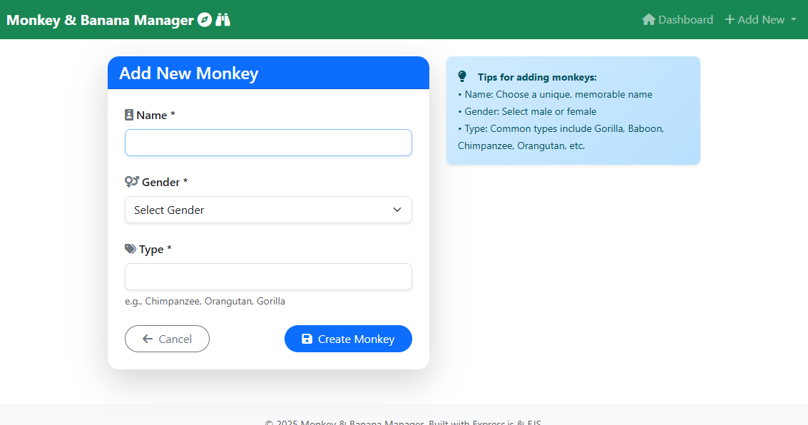

# Monkey & Banana Manager

A Node.js web application for managing monkeys and bananas with full CRUD operations, search functionality, and a clean MVC architecture.

## Features

- **Monkey Management**: Create, read, update, and delete monkey records
- **Banana Management**: Create, read, update, and delete banana records
- **Search Functionality**: Search across both monkeys and bananas
- **Web Interface**: User-friendly forms and data display
- **REST API**: Complete API endpoints for all operations
- **MVC Architecture**: Clean separation of concerns with controllers, services, and views

## Project Structure

```
monkey-banana-manager/
├── controllers/
│   ├── BananaController.js
│   ├── MonkeyController.js
│   ├── SearchController.js
│   └── ViewController.js
├── routes/
│   └── routes.js
├── services/
│   └── DatabaseService.js
├── views/
│   ├── index.ejs
│   └── form.ejs
├── public/
│   ├── css/
│   ├── js/
│   └── images/
├── index.js
├── package.json
└── README.md
```

## Installation

1. Clone the repository:
```bash
git clone https://github.com/yourusername/monkey-banana-manager.git
cd monkey-banana-manager
```

2. Install dependencies:
```bash
npm install
```

3. Start the application:
```bash
npm start
```

Or for development with auto-restart:
```bash
npm run dev
```

4. Open your browser and navigate to:
```
http://localhost:6060
```

## API Endpoints

### Monkeys
- `GET /api/monkey` - Get all monkeys
- `GET /api/monkey/:id` - Get monkey by ID
- `POST /api/monkey` - Create new monkey
- `PUT /api/monkey/:id` - Update monkey
- `DELETE /api/monkey/:id` - Delete monkey

### Bananas
- `GET /api/banana` - Get all bananas
- `GET /api/banana/:id` - Get banana by ID
- `POST /api/banana` - Create new banana
- `PUT /api/banana/:id` - Update banana
- `DELETE /api/banana/:id` - Delete banana

### Search
- `POST /api/search` - Search across monkeys and bananas

## Data Models

### Monkey
```json
{
  "id": "string",
  "name": "string",
  "gender": "string",
  "type": "string"
}
```

### Banana
```json
{
  "id": "string",
  "color": "string",
  "sweet": "boolean",
  "monkeyId": "string"
}
```

## Dependencies

- **Express**: Web framework for Node.js
- **EJS**: Templating engine for rendering views
- **Body-parser**: Middleware for parsing request bodies

## Development Dependencies

- **Nodemon**: Development tool for auto-restarting the server

## Contributing

1. Fork the repository
2. Create a feature branch (`git checkout -b feature/new-feature`)
3. Commit your changes (`git commit -am 'Add new feature'`)
4. Push to the branch (`git push origin feature/new-feature`)
5. Create a Pull Request

## License

This project is licensed under the MIT License - see the LICENSE file for details.

## Future Enhancements

- [ ] Add user authentication
- [ ] Implement data persistence with a real database
- [ ] Add unit tests
- [ ] Add data validation
- [ ] Implement pagination for large datasets
- [ ] Add API documentation with Swagger


